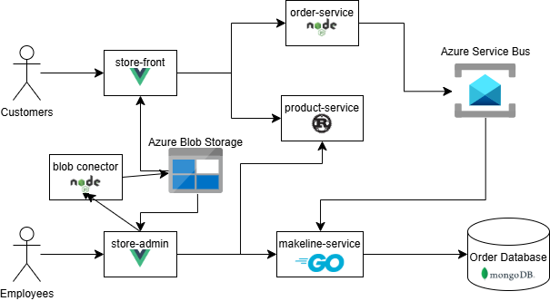

# CST8915 Final Project Documentation

## Studen information
**Student Name**: Joshua Chen

**Student ID**: 041280453

**Course**: CST8915 Full Stack Development

**Semester**: Winter 2026

### **Repository links**
#### Blob connect : 
https://github.com/JChen-AC/cst8915-blobconnect-service-final-project
https://hub.docker.com/repository/docker/jchen1101/fp-blob-connector

#### order service : 
https://github.com/JChen-AC/cst8915-order-service-final-project
https://hub.docker.com/repository/docker/jchen1101/fp-order-service

#### makeline service : 
https://github.com/JChen-AC/cst8915-makeline-service-final-project
https://hub.docker.com/repository/docker/jchen1101/fp-makeline-service/general

#### Store admin:
https://github.com/JChen-AC/cst8915-store-admin-final-project
https://hub.docker.com/repository/docker/jchen1101/fp-store-admin

#### Store front:
https://github.com/JChen-AC/cst8915-store-front-final-project
https://hub.docker.com/repository/docker/jchen1101/fp-store-front/general

#### product service: 
https://github.com/JChen-AC/cst8915-product-service-final-project
https://hub.docker.com/repository/docker/jchen1101/fp-product-service

## Demo Video
https://youtu.be/LoHTf25a_Eo

## Diagram
 

## AI Disclosure 
AI was used extensively in this project and repository
Note : All code generated with AI will have a comment stating that it was generated or AI generated code was the primary base

### Simulation
ChatGPT and Claude were used in the following ways :
- debugging
- setting up and sending code to azure service bus
- connecting to blob storage
- 

Claude was used in the following ways:
- Help determine what is needed for the documentation

## References 
- https://learn.microsoft.com/en-us/azure/storage/blobs/storage-quickstart-blobs-nodejs?tabs=managed-identity%2Croles-azure-portal%2Csign-in-azure-cli&pivots=blob-storage-quickstart-scratch

